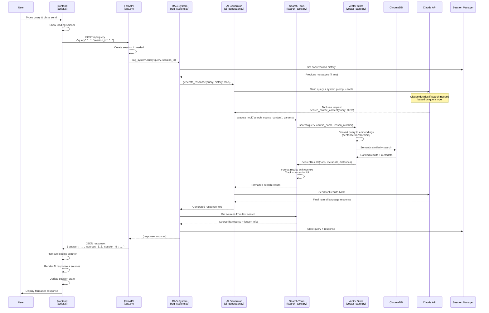
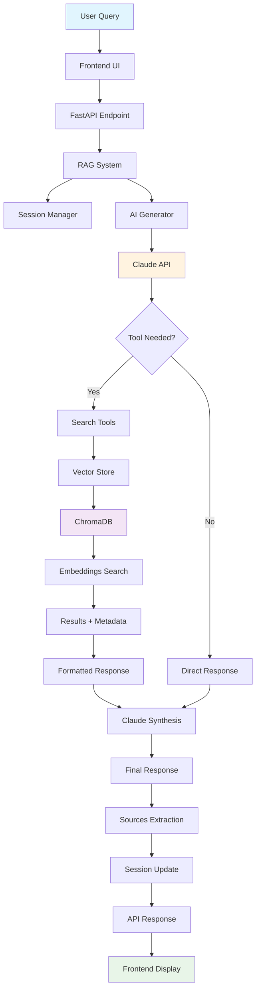
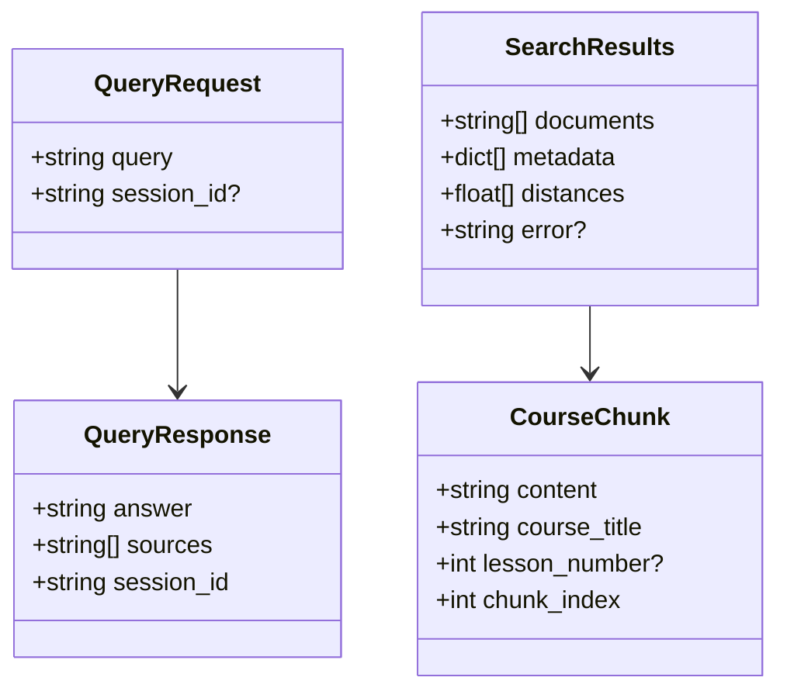

# RAG System Query Flow Diagram

## Key Components Flow

## Data Structures

## Processing Stages

1. **Input Stage**: User interaction → API request
2. **Orchestration Stage**: RAG system coordinates components
3. **Decision Stage**: Claude determines if search is needed
4. **Search Stage**: Vector similarity search in ChromaDB
5. **Synthesis Stage**: Claude generates response from search results
6. **Output Stage**: Formatted response with sources returned to UI

## Key Features Illustrated

- **Tool-based Architecture**: Claude autonomously decides when to search
- **Semantic Search**: Vector embeddings enable context-aware retrieval
- **Session Management**: Conversation history maintains context
- **Source Attribution**: UI displays where information came from
- **Chunked Content**: Documents processed into searchable segments